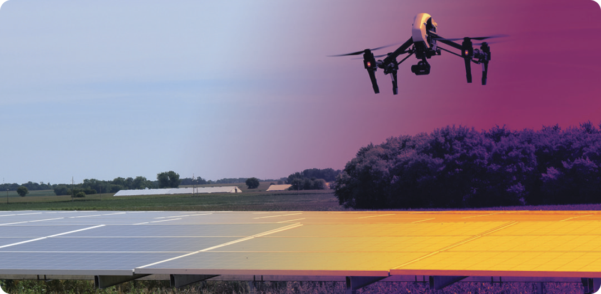
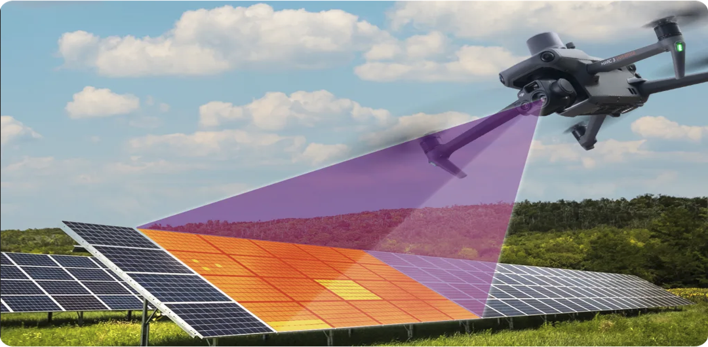
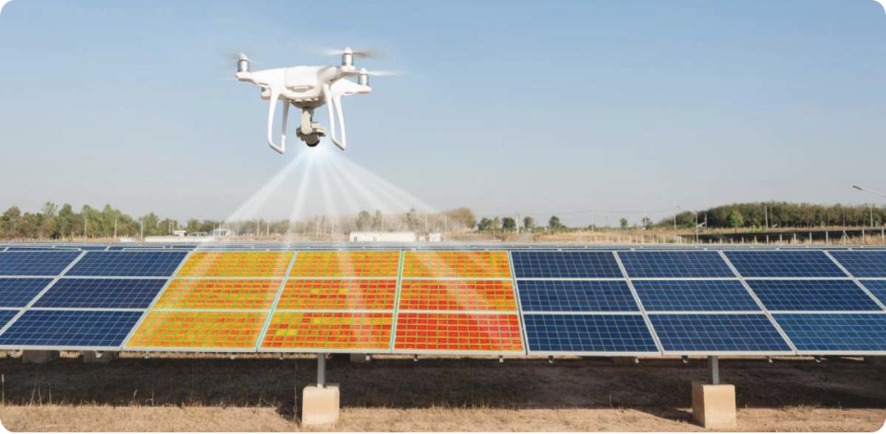
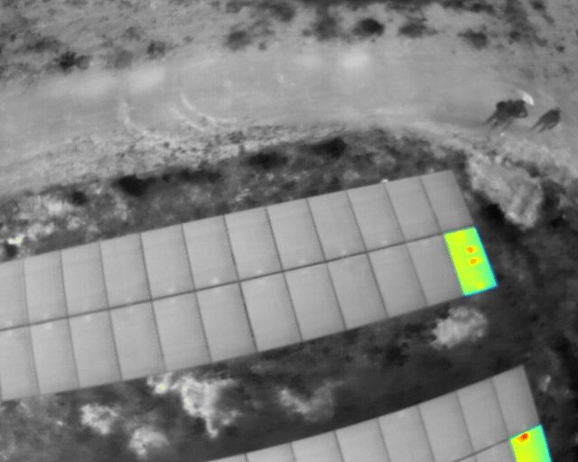

<div align="center">
    
</div>

<div align="center">
    <h1> <b> PV system Analyser </b> </h1>
</div>

A proof-of-concept (POC) to identify defective photovoltaic modules in solar plants using computer vision and deep learning techniques on infrared images to estimate generated energy losses.


# 1. Context

Large and small photovoltaic systems are susceptible to failures in their equipment, especially in PV modules due to operational stresses that are exposed and errors during the installation process. The immediate impact is perceptible in the reduction of generated power and, in the long term, the equipment's useful life.

The main method used to identify anomalies is based on time-series data from a photovoltaic system. It's not the most accurate to highlight the degradation source, due to the fact that the vast majority of solar farms use a lot of PV modules connected to each other in series mode on each inversor's input. This is required to reach the voltage and current needed to generate the power calculated by the engineer responsible for the PV system size. For micro-generation PV systems, the data analysis generated by it is sufficient to identify defects, due to the low number of modules presented. But, as generated power increases (mini generation or higher PV systems), the number of modules in each inversor's input increases too, growing the false positives found by this method.

Although different failures originate from different factors (internal and external), there's a common phenomenon among them: **defected PV modules have regions of higher temperature values, when compared to healthier ones**. These are so-called Hot spots, anomalies that reduce the module's performance. That's why thermography inspections are the main preventive maintenance procedure in this area. Through it, it's possible to learn the typical thermal high heat signature of each anomaly at an early stage without the need to stop the photovoltaic system. Basically, the camera uses infrared sensors to read the environment's temperature and generate a thermogram image (each image pixel value is a temperature). This camera can be manually operated (the inspector shoots each image by itself) or attached to a drone, automating the whole process. Currently, the second approach stands out for providing an increase in inspection area and reduction of inspection execution time.


# 2. Solution

Companies, such as [Raptor Maps](raptormaps.com/), [Sitemark](https://www.sitemark.com), and [Above](https://www.abovesurveying.com), already have solutions to these problems implemented as a SAAS. Basically, they provide a platform to upload thermographic images captured by drones, automatically detect defects through computer vision models, and generate an interactive map highlighting all issues found with temperature readings, along with a report. This allows plant owners and thermography inspectors to easily visualize defects, estimate losses, and prioritize maintenance.

I have tried to mimic them by creating a web app connected to a cloud environment using AWS solutions, open-source tools, and the [IEC TS 62446-3](https://www.iec.ch/dyn/www/f?p=103:38:408996950306243::::FSP_ORG_ID,FSP_APEX_PAGE,FSP_PROJECT_ID:1276,23,107693) standards.

## 2.1 Application steps

This project were created using a microservice approach to separate the different application's components. The following diagram shows the main components and the flow of data between them.

<div align="center">
    
</div>

## 2.2 Data sources

All data used in this project comes from public datasets available on **[Kaggle](https://www.kaggle.com/)**, platform that offers numerous resources related to data science, such as competitions, courses, notebooks and datasets. Each dataset contains labeled thermographic images of photovoltaic modules with and without defects.

<div align="center">
    <a></a>
    
    <a></a>
    
    <a></a>
</div>

[Infrared Solar Modules](https://www.kaggle.com/datasets/marcosgabriel/infrared-solar-modules) | [Photovoltaic System O&M Inspection](https://www.kaggle.com/datasets/marcosgabriel/photovoltaic-system-o-and-m-inspection) | [Photovoltaic System Thermography](https://www.kaggle.com/datasets/marcosgabriel/photovoltaic-system-thermography) |
:-: | :-: | :-: |
Dataset curated by Raptor Maps, the mainly company that delivers this kind of service. It's composed of 20000 cropped 8-bit thermal images from 11 types of photovoltaic modules anomalies. | Dataset composed of more than 5000 thermograms (TIFF) and RGB images from a photovoltaic system. | Dataset composed of 120 thermograms (RJPG images) of a 6 MWp photovoltaic system. |

## 2.3 Project Structure

```bash

```

In the following table, you can find Kaggle notebooks that explain some concepts of this project more in-depth.

| Dataset exploration | Model creation and validation | System implementation
|---|---|---|
|[Photovoltaic System Thermography](https://www.kaggle.com/code/marcosgabriel/dataset-intro-photovoltaic-system-thermography)|Segmentation||
|[Photovoltaic System O&M Inspection](https://www.kaggle.com/code/marcosgabriel/dataset-intro-photovoltaic-system-o-m-inspection)|Classification||
|[Infrared Solar Modules](https://www.kaggle.com/code/marcosgabriel/dataset-intro-infrared-solar-modules)|Tracking||


## 2.4. Results

|Dataset|Number of defects|Estimated loss|Image|
|---|---|---|---|
|||||
|||||


## 2.5 Limitations

There're some limitations due, mainly, to limitations of the datasets used, like:

* Currently, this project only support thermograms in RJPG (FLIR proprietary format) and TIFF formats;
* This project was applied only to PV systems created in enviroments with vegetation. So, the segmentation model may not work so well in datasets of PV systems located in a different kind of regions (top of buildings and snow regions);
* This project were made for only thermograms and don't use RGB images, but this can be a new feature in the future;
* The datasets used are taken with a drone in a distance +/- 30 meters from PV modules. So, the model may need to be retrained in datasets with images captured in different distances;
* Only some failures were present in training datasets, so the model may not generalize well to new types of anomalies;
* All datasets used have images of Silicon PV modules only.

# 3. Usage

## 3.1 Installation

You need to have the following dependencies installed on your machine before running this application, as them aren't included in the enviroment file of this project:

- [**Git**](https://git-scm.com/): For code versioning;
- [**Docker**](https://www.docker.com/): For microservice implementation;
- [**Poetry**](https://python-poetry.org/): For Python dependencies and enviroment management;
- [**Poe the poet**](https://poethepoet.natn.io/index.html): The task runner;

After this, just clone the repo:

```bash
git clone https://github.com/Resmung0/pv-system-analyser.git 
```

And run the `install` task:

```bash
poe install
```

## 3.2 Running the application

> [!WARNING]
> This project is still in development, so the application weren't yet fully functional.

## 3.3 Application features

<details>
<summary> <b> Financial Impact Calculus </b> </summary>

This project have the ability to calculate the overall financial impact that a PV system's output power have based on the anomalies founded. This is done by using the following formula:

$$\begin{matrix}
\begin{align}
\text{Financial impact: } P_{pa} \cdot P_{sh} \cdot \sum_{i=1}^n (\underbrace{P_{m} \cdot i \cdot f_{p}})
\end{align}
\\
\qquad \qquad \qquad \qquad \qquad \qquad \text{Single Anomaly Impact}
\end{matrix}$$

* $P_{pa}$: Purchase Power Agreement Rates (Factor that indicates how much 1 Kwh is worth in some currency);
* $P_{sh}$: Peak Sunlight Hours (Number of hours of peak sunlight per year);
* $P_{m}$: PV module's Peak Power (STC conditions);
* $i$: Number of modules affected by the anomaly;
* $f_{p}$: Defect power factor (responsible for indicating the anomaly's degree of influence on the module's power loss).
</details>


# 4. Acknowledgments

This project is an improvement of my [undergraduate thesis](https://www.linkedin.com/in/marcosggassis/overlay/1635503531693/single-media-viewer/?profileId=ACoAACn9dbUBjSR4Si_YOJ-gZl0crKKlFtkPfbY) (in Portuguese), however many parts of it were highly based on the wonderful works below:

* **[PV HAWK](https://lukasbommes.github.io/PV-Hawk/)**: A computer vision application for the automated inspection of large-scale photovoltaic (PV) plants by means of thermal infrared (IR) or visual RGB videos acquired by a drone.
* **[ANALYST PV](https://michiel-vlaminck.github.io/projects/analyst-pv/)**:  A project with goals to provide tools for fault localization, power loss quantification and improved diagnostics of PV power plants.


Other resources were important as well, like:

* **[Review of failures of PV modules](https://iea-pvps.org/wp-content/uploads/2020/01/IEA-PVPS_T13-01_2014_Review_of_Failures_of_Photovoltaic_Modules_Final.pdf)**: IEA report explaing the cause of some photovoltaic module's failures;
* **[Review of IR and EL images applications for PV systems](https://iea-pvps.org/wp-content/uploads/2020/01/Review_on_IR_and_EL_Imaging_for_PV_Field_Applications_by_Task_13.pdf)**: IEA report explaing how to use infrared and Electroluminescent images on Photovoltaic modules fault analysis;
* **[Raptor maps's knoledge hub](https://raptormaps.com/solar-tech-docs/)**: Hub of information related to thermographic aerial inspection curated by Raptor maps;
* **[Above' Blog posts](https://www.abovesurveying.com/blog/)**: Series of blog posts by Above surveying company;
* **[Roboflow blog post](https://blog.roboflow.com/georeferencing-drone-videos/)**: A Roboflow blog post explaining how to georeference points in drone images.
